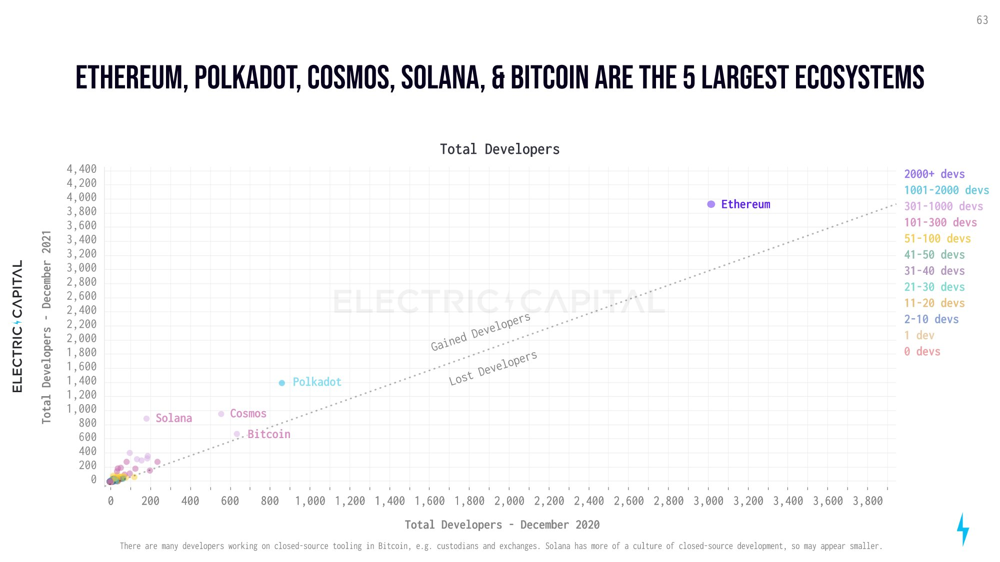
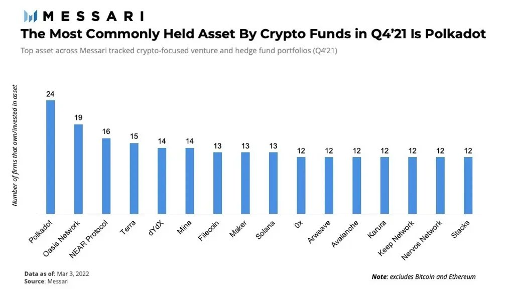
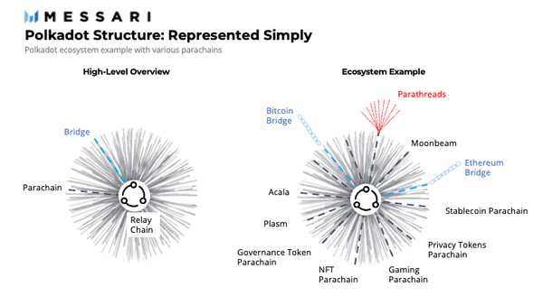
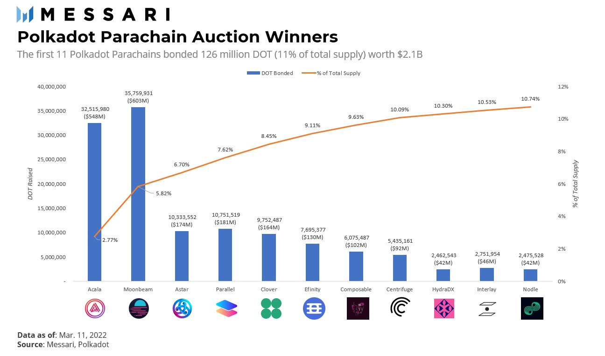
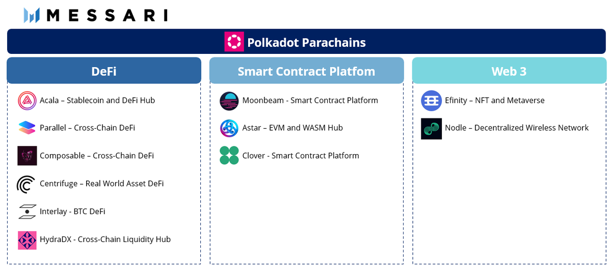

Arguably the most misunderstood ecosystem in crypto is

[@Polkadot](https://twitter.com/Polkadot)

Yet it has attracted the 2nd most devs and is the most commonly held asset by VCs??? What is this protocol that has attracted the big brains !? Well, she just came to life 3 months ago.

To recap,
[@Polkadot](https://twitter.com/Polkadot) is the brainchild of [@gavofyork](https://twitter.com/gavofyork) , with support from Co-Founder [@rphmeier](https://twitter.com/rphmeier) and [@ParityTech](https://twitter.com/ParityTech)

Polkadot uses a novel, modular architecture.

At a high level, Polkadot has two components: - A base Layer-0 (i.e. the Relay Chain) - Sovereign Layer-1s (i.e. parachains) The L-0 Relay Chain houses all validators and connects, governs, and secures the L-1 parachains.

Parachains are highly customized, application specific Layer-1 blockchains. Parachains are sovereign, yet they are not siloed because of their connection with the Relay Chain.

~Analogy: The US. The Relay Chain is the federal gov, and parachains are states. The federal gov secures, governs, and unites individual states. At the same time, states secure, govern, and coordinate themselves. Should a dispute ever arise, the federal gov outranks state govs.

In mid-December, the first parachains were connected to Polkadot. Today, 11-parachains have been on-boarded. After 11 auctions, 126 million [$DOT](https://twitter.com/search?q=%24DOT&src=cashtag_click) (11% of the total supply; worth $2.1 billion) has been bonded. 

Each of the first 11 winners bring novel functionality and use-cases to the ecosystem.

deep dive into Polkadot and the first 11 parachains:

[@MessariCrypto](https://twitter.com/MessariCrypto)