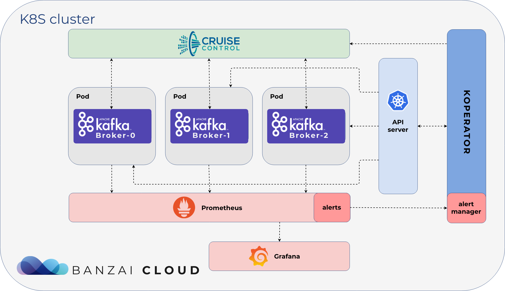
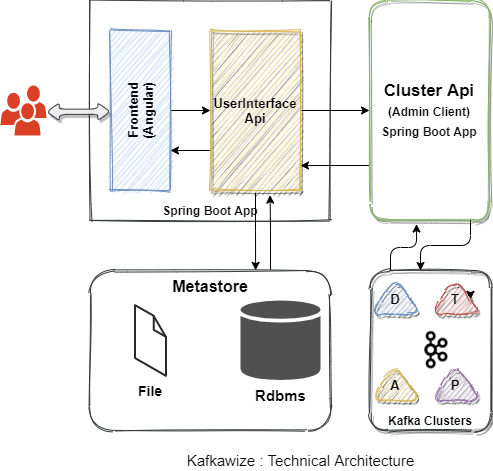

# Kafka

https://developers.redhat.com/articles/2021/07/19/benchmarking-kafka-producer-throughput-quarkus#

https://engineering.linkedin.com/kafka/benchmarking-apache-kafka-2-million-writes-second-three-cheap-machines

https://www.youtube.com/watch?v=PzPXRmVHMxI

https://docs.confluent.io/platform/current/quickstart/ce-docker-quickstart.html


## KAFKA - WSL

```shell

cd /mnt/d/apps/kafka_2.13-3.2.0/

bin/zookeeper-server-start.sh config/zookeeper.properties

bin/kafka-server-start.sh config/server.properties

bin/kafka-topics.sh --create --bootstrap-server localhost:9092 --replication-factor 1 --partitions 3 --topic ufo

bin/kafka-console-consumer.sh --topic ufo --from-beginning --bootstrap-server localhost:9092  --property print.key=true --property print.timestamp=true

````


## Redpanda

```shell
rpk container start -n 3

rpk topic create ufo --brokers 127.0.0.1:50494,127.0.0.1:50500,127.0.0.1:50499 --partitions 3

rpk topic consume ufo --brokers 127.0.0.1:50494,127.0.0.1:50500,127.0.0.1:50499 --partitions 3

rpk container purge
```

## Confluence kafka

```shell
curl --output docker-compose.yml \                                                                                              https://raw.githubusercontent.com/confluentinc/cp-all-in-one/7.1.1-post/cp-all-in-one/docker-compose.yml

docker-compose up -d

docker-compose ps

docker-compose stop

docker system prune -a --volumes --filter "label=io.confluent.docker"

```


## RUST - rdkafka

https://github.com/fede1024/rust-rdkafka

```toml
rdkafka = "0.28"
```


A fully asynchronous, futures-enabled Apache Kafka client library for Rust based on librdkafka.

The library
rust-rdkafka provides a safe Rust interface to librdkafka. The master branch is currently based on librdkafka 1.8.2.


### Benchmark

https://github.com/fede1024/kafka-benchmark


## Librdkafka

https://github.com/edenhill/librdkafka/blob/master/INTRODUCTION.md#broker-version-compatibility


# Kafka


https://docs.rs/kafka/latest/kafka/


https://kafka.apache.org/documentation.html#quickstart


https://kafka.apache.org/31/documentation/streams/quickstart


https://kafka.apache.org/31/documentation/streams/


## Kafka usage


```shell
/usr/local/opt/kafka/bin/kafka-topics --create --topic ufos --bootstrap-server localhost:9092

/usr/local/opt/kafka/bin/kafka-topics --describe --topic ufos --bootstrap-server localhost:9092

/usr/local/opt/kafka/bin/kafka-console-producer --topic ufos --bootstrap-server localhost:9092

/usr/local/opt/kafka/bin/kafka-console-consumer --topic ufos --from-beginning --bootstrap-server localhost:9092

```


## Rust examples:

https://github.com/kafka-rust/kafka-rust/blob/master/examples/console-consumer.rs


## Confluence

https://www.confluent.io/blog/crossing-streams-joins-apache-kafka/


---

# Red Panda

https://redpanda.com/


https://docs.redpanda.com/docs/reference/faq/


```shell
brew install redpanda-data/tap/redpanda && rpk container start
```

```log
Redpanda - The fastest queue in the west!

This installs RPK which, with Docker, enables the running of a local cluster
for testing purposes.

You can start a 3 node cluster locally using the following command:

    rpk container start -n 3

You can then interact with the cluster using commands like the following:

    rpk topic list

When done, you can stop and delete the cluster with the following command:

    rpk container purge

For information on how to setup production evironments, check out our
installation guide here: https://vectorized.io/documentation/setup-guide/
```

Redpanda is a modern streaming platform for mission critical workloads. With Redpanda you can get up and running with streaming quickly and be fully compatible with the Kafka ecosystem.

This quick start guide can help you get started with Redpanda for development and testing purposes. For production or benchmarking, setup a production deployment.

## Get your cluster ready
To get a cluster ready for streaming, either run a single docker container with Redpanda running or a cluster of 3 containers.

```admonish note
You can also use rpk container to run Redpanda in containers without having to interact with Docker at all.
Single command for a 1-node cluster
With a 1-node cluster you can test out a simple implementation of Redpanda.
```

```admonish warning
--overprovisioned is used to accommodate docker resource limitations.
--pull=always makes sure that you are always working with the latest version.
```

```shell
docker run -d --pull=always --name=redpanda-1 --rm \
-p 8081:8081 \
-p 8082:8082 \
-p 9092:9092 \
-p 9644:9644 \
docker.redpanda.com/vectorized/redpanda:latest \
redpanda start \
--overprovisioned \
--smp 1  \
--memory 1G \
--reserve-memory 0M \
--node-id 0 \
--check=false
```

You can do some simple topic actions to do some streaming. Otherwise, just point your Kafka-compatible client to **127.0.0.1:9092**.


```shell
 rpk container start
Downloading latest version of Redpanda
Starting cluster
Waiting for the cluster to be ready...
  NODE ID  ADDRESS
  0        127.0.0.1:50725

Cluster started! You may use rpk to interact with it. E.g:

rpk cluster info --brokers 127.0.0.1:50725

[~] : rpk cluster info --brokers 127.0.0.1:50725
BROKERS
=======
ID    HOST       PORT
0*    127.0.0.1  50725


```


## streaming
Here are some sample commands to produce and consume streams:

Create a topic. We'll call it "twitch_chat":
```shell
docker exec -it redpanda-1 \
rpk topic create twitch_chat --brokers=localhost:9092
```

Produce messages to the topic:
```shell
docker exec -it redpanda-1 \
rpk topic produce twitch_chat --brokers=localhost:9092
```
Type text into the topic and press Ctrl + D to separate between messages.

Press Ctrl + C to exit the produce command.

Consume (or read) the messages in the topic:
```shell
docker exec -it redpanda-1 \
rpk topic consume twitch_chat --brokers=localhost:9092
```

Each message is shown with its metadata, like this:
```json
{
"message": "How do you stream with Redpanda?\n",
"partition": 0,
"offset": 1,
"timestamp": "2021-02-10T15:52:35.251+02:00"
}
```

You've just installed Redpanda and done streaming in a few easy steps.

## Clean Up
When you are finished with the cluster, you can shutdown and delete the containers. Change the commands below accordingly if you used the 1-cluster option, or the 3-cluster option.

```shell
docker stop redpanda-1 redpanda-2 redpanda-3 && \
docker rm redpanda-1 redpanda-2 redpanda-3
```
If you set up volumes and a network, delete them with:

```shell
docker volume rm redpanda1 redpanda2 redpanda3 && \
docker network rm redpandanet
```


## KAFKA OPS


### Julie 

https://github.com/kafka-ops/julie

JulieOps helps you automate the management of your things within Apache Kafka, from Topics, Configuration to Metadata but as well Access Control, Schemas

java, docker, rpm ..


- Support for multiple access control mechanisms:
  - Traditional ACLs
  - Role Bases Access Control as provided by Confluent
- Automatically set access control rules for:
  - Kafka Consumers
  - Kafka Producers
  - Kafka Connect
  - Kafka Streams applications ( microservices )
  - KSQL applications
  - Schema Registry instances
  - Confluent Control Center
  - KSQL server instances
- Manage topic naming with a topic name convention
  - Including the definition of projects, teams, datatypes and for sure the topic name
  - Some topics are flexible defined by user requirements
- Allow for creation, delete and update of:
  - topics, following the topic naming convention
  - Topic configuration, variables like retention, segment size, etc
  - Acls, or RBAC rules
  - Service Accounts (Experimental feature only available for now in Confluent Cloud)
- Manage your cluster schemas.
  - Support for Confluent Schema Registry


### TopicCTL

https://github.com/segmentio/topicctl

A tool for easy, declarative management of Kafka topics. Includes the ability to "apply" topic changes from YAML as well as a repl for interactive exploration of brokers, topics, consumer groups, messages, and more.

go, docker


### Terreform provider kafka

https://github.com/Mongey/terraform-provider-kafka

A Terraform plugin for managing Apache Kafka.

https://www.terraform.io/

go, cloud


### Strimzi

https://strimzi.io/

Kafka on Kubernetes in a few minutes
Strimzi provides a way to run an Apache Kafka cluster on Kubernetes in various deployment configurations.


### Kafka gitOps

https://github.com/devshawn/kafka-gitops

Manage Apache Kafka topics and ACLs through a desired state file.
This tool supports self-hosted Kafka, managed Kafka, and Confluent Cloud clusters.

### Kafka Helmsman

https://github.com/teslamotors/kafka-helmsman

kafka-helmsman is a repository of tools that focus on automating a Kafka deployment. These tools were developed by data platform engineers at Tesla, they add value to the open-source Kafka ecosystem in a couple of ways:

The tasks covered by these tools are infamous for adding toil on engineers, for us these tools save engineering weeks each quarter
They have been battle-tested internally, high quality and user-friendly
The tools are

- Kafka consumer freshness tracker
- Kafka topic enforcer
- Kafka roller
- Kafka quota enforcer


### Jikkou

https://github.com/streamthoughts/jikkou

Jikkou (jikkō / 実行) is an open-source tool to help you automate the management of the configurations that live on your Apache Kafka clusters. It was developed by Kafka ❤️ to make daily operations on an Apache Kafka cluster simpler for both developers and administrators.

It can efficiently manage configuration changes for Topics, ACLs, Quotas and more with the use of resource specification files. It is also applicable to quickly replicate the configuration of a production cluster to another with a few command lines or to initialize a new cluster for testing purpose.

Note: Jikkou is the project formerly known as Kafka Specs. Old versions of this project can still be found under that name.

The main usage scenarios
- Create new resource entities on an Apache Kafka cluster (i.e., Topics, ACLs, and Quotas).
- Update the configurations of existing resource entities.
- Delete resource entities which are not anymore managed.
- Describe all the configuration defined for Brokers.
- Describe all the configuration defined for Topics, ACLs, and Quotas.

Core features that make it awesome
- Simple command line interface (CLI) for end user.
- Simple Java API on top of the Kafka’s Java AdminClient.
- Completely stateless and thus does not store any state (Basically: Your kafka cluster is the state of Jikkou).
- Pluggable validation rules to ensure that resources meet your requirement before being created or updated ona target cluster.
- Pluggable resource manager to extend Jikkou with cloud managed services for Apache Kafka which are supported out-of-the-box.
- Simple templating mechanism using Jinja notation.


### ns4kafka

https://github.com/michelin/ns4kafka

Ns4kafka brings to Apache Kafka a new deployment model for your different Kafka resources following the best practices from Kubernetes :

- Namespace isolation. You can manage your own Kafka resources within your namespace, and you don't see Kafka resources managed by other namespaces. Isolation is provided by granting ownership on names and prefixes to Namespaces
- Desired state. You define how the deployed resources should look like and ns4kafka will align the Kafka cluster with your desired state.
- Server side validation. Customizable validation rules defined by Kafka OPS to enforce values on Topic configs (min.insync.replica, replication.factor, ...) or Connect configs (connect.class, consumer.override.jaas, ...).
- Robust CLI for all your CI/CD needs. The kafkactl command line tool lets you control your resources within your namespace. You can deploy resources, list or delete them, reset consumer groups and so on.
- An evolving list of Resources. As Kafka project teams, you can now become fully autonomous managing Kafka Topics, Connectors, Schemas, AccessControlEntries and ConsumerGroups. Kafka Admin are treated equaly only with different resources to manage : Namespaces, RoleBindings, ResourceQuotas, ResourceValidators, AccessControlEntries, ...

Ns4kafka is built on top of 2 components : an API and a CLI.

- The Ns4kafka API exposes all the required controllers to list, create and delete Kafka resources. It must be deployed and managed by Kafka administrators.
- The Kafkactl CLI is, much like K8S's kubectl, a wrapper on the API to let any user or CI/CD pipeline deploy Kafka resources using yaml descriptors. It is made available to any project who needs to manage Kafka resources.


### kafkaer


https://github.com/navdeepsekhon/kafkaer


Kafkaer is a deployment and configuration tool for Apache Kafka. It allows you to automate creation/update of topics and brokers across multiple environments. Create one template configration file and control using different properties files.

Current features:

- Create topics
- Update configurations and partitions for existing topics
- Update configs for a specific broker
- Update configs for entire kafka cluster
- Create/update Access control lists (ACLs)
- Delete all topics created by tool
- Delete all schemas from schema registry when deleting topics


### koperator

https://github.com/banzaicloud/koperator


Apache Kafka is an open-source distributed streaming platform, and some of the main features of the Koperator are:

- the provisioning of secure and production ready Kafka clusters
- fine grained broker configuration support
- advanced and highly configurable External Access via LoadBalancers using Envoy
- graceful Kafka cluster scaling and rebalancing
- monitoring via Prometheus
- encrypted communication using SSL
- automatic reaction and self healing based on alerts (plugin system, with meaningful default alert plugins) using Cruise Control
- graceful rolling upgrade
- advanced topic and user management via CRD

- Koperator architecture


We took a different approach to what's out there - we believe for a good reason - please read on to understand more about our design motivations and some of the scenarios which were driving us to create Koperator.

Koperator is a core part of Banzai Cloud Supertubes (now called Cisco Streaming Data Manager) that helps you create production-ready Apache Kafka clusters on Kubernetes, with scaling, rebalancing, and alerts based self healing. While the Koperator itself is an open-source project, the Banzai Cloud Supertubes product extends the functionality of Koperator with commercial features (for example, built-in monitoring and multiple ways of disaster recovery). Read a detailed comparison of Supertubes and Koperator.


### KafkaWize

https://github.com/muralibasani/kafkawize

Kafkawize is now fully opensource. 🥳 All the features of the Kafkawize are now available at no cost.

Kafkawize is a Self service Apache Kafka Topic Management/Governance tool/portal. It is a web application which automates the process of creating and browsing Kafka topics, acls, avro schemas, connectors by introducing roles/authorizations to users of various teams of an organization.



!Note: Supports avro schema registry!

https://kafkawize.readthedocs.io/en/latest/features.html


