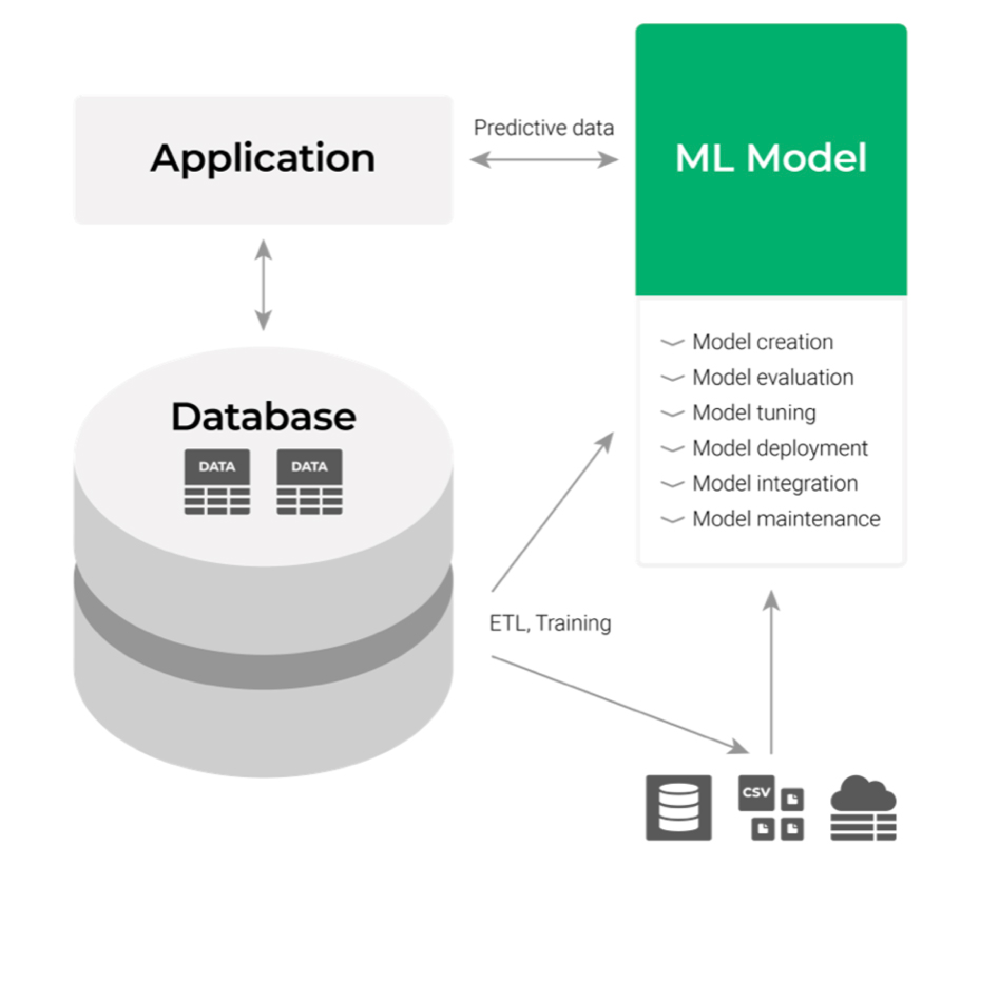
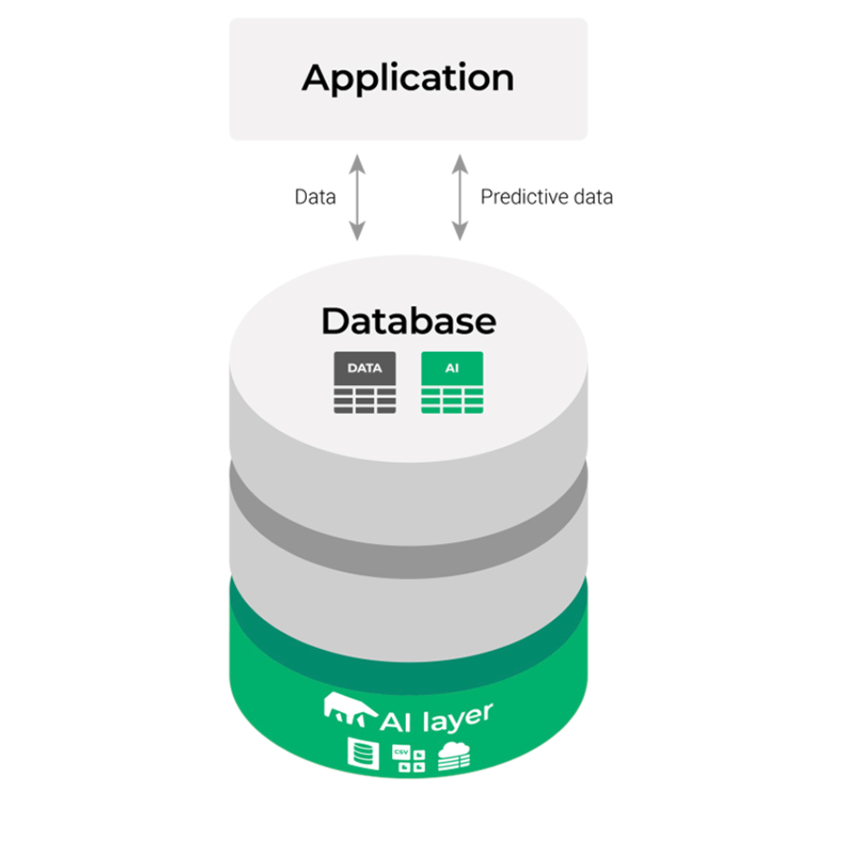

# MindsDB

https://mindsdb.com/[]

## Intro 

A predictive layer for existing databases that enables rapid prototyping & deployment of ML Models from your database. Significantly reducing the time and cost of machine learning workflows.

From:

To:

Get the predictions you need as simple tables in your database.

Use your data at the source to train & deploy Machine Learning models and get the predictions you need as tables. Query the results anytime in seconds as if they were existing tables.

AI Tables are created with simple queries inside the database or data store and contain predictions generated in real-time by the models.

MindsDB looks and acts like a database and thus seamlessly interacts with your current database and BI tools.

## Brochure

xref::resources/mindsdb/MindsDB Product Brochure F21.pdf[]

## Use cases

There is a MindsDB application for any business question you may have

### Churn Reduction
Acquiring a new customer can cost five times more than retaining an existing customer. Therefore, it is essential for marketing departments to make sure they keep customers satisfied and to provide them with personalized offers at the right time in order to reduce customer turnover.​

### Employee Retention Management
Keeping well trained quality employees nowadays is the primary goal in growing organisations. Our platform enables HR teams to get a holistic view of employee behavior to increase job satisfaction and to help retain them.

### Credit Scoring
Determining which customers to give credit to, is still the key challenge for most financial institutions. With accurate predictive models MindsDB helps financial institutions determine customers’ credit worthiness.

### Customer Lifetime Value Optimization
Acquiring and nurturing customers to ensure continuous revenue is a key objective for most businesses. By using advanced machine learning algorithms we help companies understand who their customers are and their value over their lifetime.

### Direct Marketing
Marketing, when done correctly, can help your business remain competitive. With MindsDB’s advanced machine learning technology, you can increase your ROI by drilling down on your marketing to better target and reach the type of customers most likely to respond to your campaigns.

### Fraud Detection
For advanced businesses it is a constant challenge to keep up with fraud techniques. Using fraud detection algorithms, MindsDB scores transactions that may seem fraudulent and automatically flag and reject them.

### Fraudulent Claim Detection
Fraudulent claims are expensive. Additionally, most insurers don’t have the resources to investigate every claim. Using MindsDB’s advanced machine learning platform, insurers can detect which claims are most likely to be fraudulent based on certain characteristic and investigate the fraudulent claims accordingly.

### Inventory Management
Accurate predictions on how much of a product or item needs to be produced has a massive impact on working capital. MindsDB’s powerful platform provides you with a robust tool that takes the guesswork out of determining product demand.

### Loan Recovery
Loans can be expensive. Loan recovery even more so. Using machine learning models MindsDB helps banks and financial institutions to identify at-risk customers, predict loan recovery dates, and organize debt collection efforts.

### Patient Health Outcomes
In healthcare time is key. Using predictive modeling helps to identify patients at risk for adverse events. MindsDB uses machine learning to empower healthcare organizations to predict patient health outcomes before they occur.

### Predictive Maintenance
Unplanned downtime can be disastrous to any organization. MindsDB uses machine learning to enable your predictive maintenance minimize equipment failure, reduce errors and lessen unplanned downtime.

### Price modelling
Optimizing pricing decision-making represents one of the largest, multi-million dollar opportunities for companies to drive incremental sales and profits. Through our platform we help make more informed pricing decisions.

### Product Personalization
Today’s customers expect highly customized experiences from retailers and e-commerce providers. Our platform uses machine learning algorithms based on historical data on sales and traffic to understand and predict individual customer preferences.

### Quality Assurance
Quality Assurance is no stranger to automation. Using AI MindsDB helps to reduce test coverage overlaps, increase predictability in testing, and both detect and prevent defects.

### Risk Assessment
An accurate prediction model is the cornerstone of todays risk assessement. MindsDB makes vast amounts of data accessible to build models that improve decision making.